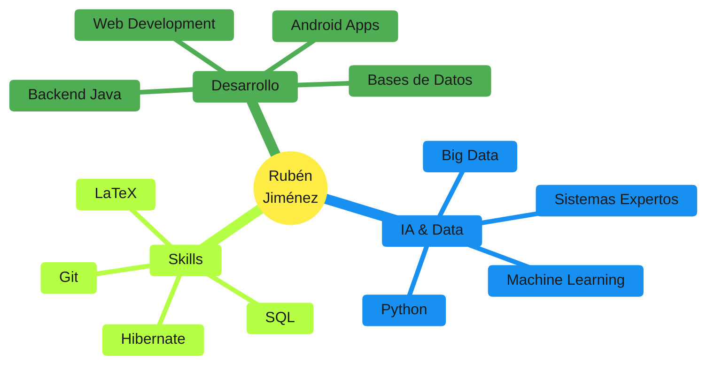

<div align="center">

# 👋 ¡Hola! Soy Rubén Jiménez


[](https://github.com/RJL08)
[](https://github.com/RJL08)


</div>

---

## 🚀 Sobre mí

Soy **Desarrollador de Aplicaciones Multiplataforma** con formación en **Inteligencia Artificial y Big Data**. Me apasiona crear soluciones tecnológicas innovadoras y estar en constante aprendizaje.

```python
class RubenJimenez:
    def __init__(self):
        self.username = "RJL08"
        self.role = "Full Stack Developer & AI Specialist"
        self.education = {
            "dam": "Grado Superior DAM (Desarrollo Aplicaciones Multiplataforma)",
            "current": "Especialización en IA y Big Data"
        }
        self.location = "España 🇪🇸"
        self.interests = ["AI", "Big Data", "Mobile Development", "Backend"]
    
    def say_hi(self):
        print("¡Gracias por visitar mi perfil! Siempre abierto a nuevos proyectos 🚀")

me = RubenJimenez()
me.say_hi()
```

---

## 🎓 Formación

### 📚 Grado Superior - Desarrollo de Aplicaciones Multiplataforma (DAM)
- ✅ **Programación:** Java, POO, Patrones de Diseño
- ✅ **Desarrollo Web:** HTML5, CSS3, JavaScript
- ✅ **Desarrollo Móvil:** Java para Android Studio
- ✅ **Bases de Datos:** SQL, MySQL, PostgreSQL
- ✅ **Acceso a Datos:** Hibernate, JavaBeans, Ficheros XML

### 🤖 Especialización - Inteligencia Artificial y Big Data (En curso)
- 🔄 **Lenguaje:** Python
- 🔄 **Machine Learning:** Scikit-learn, TensorFlow
- 🔄 **Sistemas Expertos:** Sistemas basados en reglas
- 🔄 **Big Data:** Análisis de datos, procesamiento
- 🔄 **Documentación Técnica:** LaTeX

---

## 💻 Stack Tecnológico

### Lenguajes de Programación
<div align="center">


</div>


### Frameworks & Tecnologías
<div align="center">


</div>

### IA & Data Science
<div align="center">


</div>


### Herramientas de Desarrollo
<div align="center">


</div>

---

## 📊 Estadísticas de GitHub

<div align="center">


</div>

<div align="center">


</div>

---

## 🏆 Proyectos Destacados

### 🚗 [Sistema de Diagnóstico de Vehículos](https://github.com/RJL08/diagnostico-vehiculos)
Sistema experto basado en reglas para diagnosticar problemas automotrices.
- **Tecnologías:** Python, Sistemas Expertos, IA
- **Características:** Árbol de decisión, diagnósticos precisos, documentación LaTeX
- **Destacado:** Implementación de sistema basado en reglas IF-THEN

### 📱 [Proyectos Android]
Aplicaciones móviles desarrolladas durante DAM.
- **Tecnologías:** Java, Android Studio, SQLite
- **Skills:** UI/UX, Persistencia de datos, APIs

### 🌐 [Proyectos Web]
Desarrollo de aplicaciones web fullstack.
- **Frontend:** HTML5, CSS3, JavaScript
- **Backend:** Java, Hibernate, SQL
- **Arquitectura:** MVC, REST APIs

---

## 🌱 Actualmente

- 🔭 Trabajando en proyectos de **Machine Learning**
- 🌱 Profundizando en **Python avanzado** y **Big Data**
- 💡 Explorando **Deep Learning** y **Redes Neuronales**
- 📚 Estudiando **algoritmos de IA** y **sistemas expertos**
- 🎯 Objetivo: Combinar desarrollo de aplicaciones con IA

---

## 🎯 Áreas de Especialización



---

## 📈 Contribuciones

<div align="center">


</div>

---

## 🏆 GitHub Trophies

<div align="center">

[](https://github.com/ryo-ma/github-profile-trophy)

</div>

---

## 💼 Habilidades Técnicas

<details>
<summary>🔧 <b>Backend Development</b></summary>
<br>

- ✅ Java (Avanzado)
- ✅ Programación Orientada a Objetos
- ✅ Hibernate & JPA
- ✅ JavaBeans
- ✅ Acceso a Datos (XML, JSON)
- ✅ Patrones de Diseño
- ✅ SQL & Bases de Datos Relacionales

</details>

<details>
<summary>📱 <b>Mobile Development</b></summary>
<br>

- ✅ Android Studio
- ✅ Java para Android
- ✅ SQLite
- ✅ Material Design
- ✅ APIs & REST

</details>

<details>
<summary>🌐 <b>Frontend Development</b></summary>
<br>

- ✅ HTML5 & Semántica
- ✅ CSS3 & Responsive Design
- ✅ JavaScript
- ✅ DOM Manipulation
- ✅ AJAX & Fetch API

</details>

<details>
<summary>🤖 <b>AI & Data Science</b></summary>
<br>

- 🔄 Python (En progreso)
- 🔄 Machine Learning
- 🔄 Sistemas Expertos
- 🔄 Procesamiento de Datos
- 🔄 Big Data Analytics
- 🔄 TensorFlow & Scikit-learn

</details>

<details>
<summary>🛠️ <b>Tools & Others</b></summary>
<br>

- ✅ Git & GitHub
- ✅ Control de Versiones
- ✅ IntelliJ IDEA
- ✅ VS Code
- ✅ Android Studio
- ✅ LaTeX (Documentación Técnica)
- ✅ MySQL Workbench
- ✅ Postman

</details>

---

## 📫 Contacto

<div align="center">

[](mailto:tu-email@ejemplo.com)
[](https://linkedin.com/in/tu-usuario)
[](https://tu-portfolio.com)

</div>

---

## 💭 Quote del Día

<div align="center">


</div>

---

<div align="center">

### 🌟 "Code is like humor. When you have to explain it, it's bad." - Cory House

**⭐ Si te interesa mi trabajo, no dudes en seguirme o contactarme ⭐**


</div>
