<div align="center">

# 🚀 Rubén Jiménez

**Full Stack Developer** × **AI Enthusiast** × **Lifelong Learner**


</div>

---

## 📖 Mi Historia

```mermaid
timeline
    title Mi Trayectoria Profesional
    2022-2024 : Grado Superior DAM
              : Java, Android, Web Development
              : Hibernate, SQL, JavaBeans
    2024-2025 : Especialización IA & Big Data
              : Python, Machine Learning
              : Sistemas Expertos
    2025-... : ¿Próximos desafíos?
             : Tu proyecto podría estar aquí 🚀
```



---

## 💡 ¿Qué hago?

<table>
<tr>
<td width="50%">

### 🎯 DAM Graduate

```java
public class Developer {
    private String name = "Rubén";
    
    public void mySkills() {
        String[] backend = {"Java", "SQL", "Hibernate"};
        String[] frontend = {"HTML5", "CSS3", "JS"};
        String[] mobile = {"Android Studio"};
        String[] data = {"JavaBeans", "XML"};
    }
}
```

</td>
<td width="50%">

### 🤖 AI Specialist

```python
class AISpecialist:
    def __init__(self):
        self.current_focus = [
            "Python",
            "Machine Learning",
            "Expert Systems",
            "Big Data"
        ]
    
    def learning_mode(self):
        return "Always ON 🔥"
```

</td>
</tr>
</table>

---

## 🔧 Tecnologías que domino

<div align="center">

### Backend & Databases


### Frontend


### Mobile


### AI & Data Science


### Tools


</div>

---

## 📊 Estadísticas

<div align="center">


</div>

---

## 🏆 Proyectos Destacados

<div align="center">

[](https://github.com/RJL08/diagnostico-vehiculos)

</div>

### 🚗 Sistema de Diagnóstico de Vehículos
Sistema experto en Python con arquitectura basada en reglas.
- Implementación de árbol de decisión
- Documentación técnica en LaTeX
- Diagnósticos precisos y recomendaciones

---

## 🌱 Actualmente

- 🔭 Desarrollando proyectos de **Machine Learning**
- 🌱 Aprendiendo **Deep Learning** y **Big Data**
- 💡 Explorando **sistemas expertos avanzados**
- 📚 Documentando todo en **LaTeX**
- 🎯 Buscando oportunidades para aplicar **IA en aplicaciones móviles**

---

## 📬 Hablemos

<div align="center">

[](mailto:tu-email@ejemplo.com)
[](https://linkedin.com/in/tu-usuario)

</div>

---

<div align="center">

**✨ "El mejor código es el que resuelve problemas reales" ✨**


</div>
